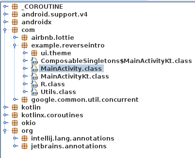
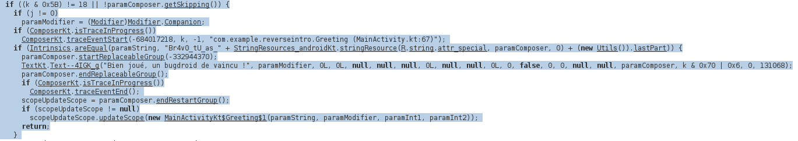
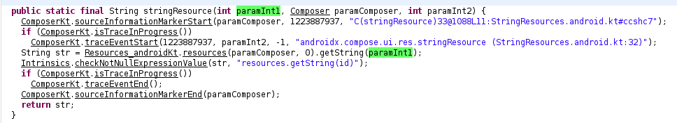
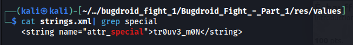

# Bugdroid Fight 1/2

## Speech
```
Un Bugdroid sauvage apparait !
Il est temps de mettre vos compétences de boxe en pratique, mais attention, cette fois il n'y a ni ring ni arbitre. Assurez-vous de bien observer autour de vous car, comme sur le ring, il est important de connaître les habitudes de son adversaire. Bon courage,
Retrouvez le message du Bugdroid.
Format de flag : 404CTF{message}
```

## Author
@Whiplash

## MD5
Bugdroid_Fight_-_Part_1.apk = b6b8c45a4243a6de63fcdaf86a1f6a10

## Basic static
1. It's an APK, so lets install `sudo apt-get insatall jd-gui dex2jar`
2. Now transform the APK to JAR via dex2jar : `d2j-dex2jar Bugdroid_Fight_-_Part_1.apk`
3. Now fire up jd-gui

4. We see an airbnb.lottie and they are a lot of thing in it, it might be a rabbit hole, I think they used a real app and add some malicious things. We are looking for a message, so I go in the *MainActivity.class* of  *example.reverseintro* but nothing very interesting but we have the *MainActivityKt.class* to look at
5. The code is obfuscated and long, but after a little bit of reading I get that :

6. The message is : `"Br4v0_tU_as_" + StringResources_androidKt.stringResource(R.string.attr_special, paramComposer, 0) + (new Utils()).lastPart)`
7. By clicking on `Utils().lastPart` I get this : 
```Java
public class Utils {
  String lastPart = "_m3S5ag3!";
}
```
8. Just to get the middle part : `StringResources_androidKt.stringResource(R.string.attr_special, paramComposer, 0)` I know `R.string.attr_special` is **2131492905**
9. We see : `StringResources_androidKt.stringResource` which mean we are looking for a string in the resources of the apk `(R.string.attr_special, paramComposer, 0)`, if we go to the function `stringResouce` we get this :

10. That tell us we need to find the ressource file but we don't have it in the jd-gui
11. I used `apktool` in order to extract all the objects of the apk, the strings are usually in *res/values*, and if we look at the file *strings.xml* in this folder we find that :

12. We just have to make the puzzle : 404CTF{Br4v0_tU_as_tr0uv3_m0N_m3S5ag3!}
