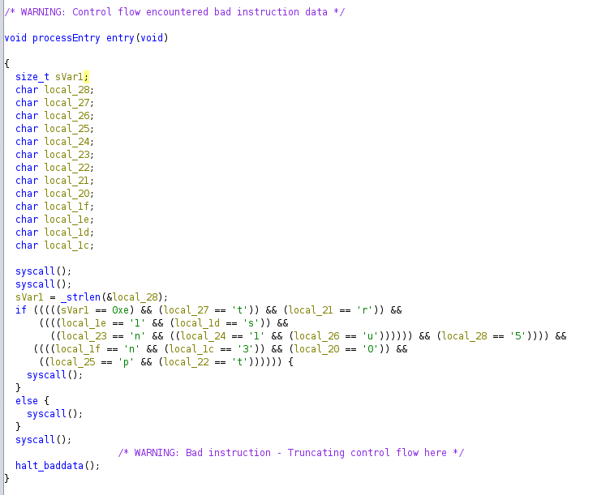

# Intronisation du CHAUSSURE

## Speech
```
Montrez votre valeur

Le CHAUSSURE, cette fameuse entité pionnière dans le domaine du sport de combat a ouvert un tournoi pour tous les chat-diateurs qui souhaiteraient se mesurer au reste du monde. Les présélections commencent et un premier défi a été publié par le CHAUSSURE. Ce dernier semble très cryptique, à vous d'en déceler les secrets!

Format de flag : 404CTF{mot-de-passe}
```

## Author
@Narcisse

## MD5
intronisation = 0fb68482db31333df0cf211830b9f5ff

## Basic static

```Bash
$ file intronisation 
intronisation: ELF 64-bit LSB executable, x86-64, version 1 (SYSV), statically linked, not stripped

& strings intronisation # Not much but enough
?su{H
?nunH
?1uaH
?uuTH
?5uGH
?nu:H
?3u-H
?0u H
Bienvenue, r
tro-ing
nieur en herbe!
Montre moi que tu es 
 la hauteur :
>>> Mauvaise r
ponse...
Bravo !!!
challenge.asm
_strlen
_strlen_next
_strlen_null
defeat
victory
welcome
lost
__bss_start
_edata
_end
.symtab
.strtab
.shstrtab
.text
.data
```

## Advanced static (GHIDRA !!!)

1. Looks like an ASM binary because no import and only some syscall :) Don't think so ? look at the entry point by yourself :

2. Also we can see he is making comparison in what looks like a random way... But ! We can see we have the sVar1 which is the size and must be equal to 0xe (14).
3. All the *local_* variable seems linked, so let's changed the type (*right click on the variable name then click on the three dots*) of the first one (*local_28*) and give it the type *generic_clib_64* > *char[14]*
4. Now lets solve this little puzzle :
```
(local_28[1] == 't')) && (local_28[7] == 'r')) &&
((((local_28[10] == '1' && (local_28[11] == 's')) &&
((local_28[5] == 'n' && ((local_28[4] == '1' && (local_28[2] == 'u')))))) &&
(local_28[0] == '5')))) &&
((((local_28[9] == 'n' && (local_28[12] == '3')) && (local_28[8] == '0')) &&
((local_28[3] == 'p' && (local_28[6] == 't')))))
```
5. After a little bit of manual work :
```
local_28[0]=='5'
local_28[1]=='t'
local_28[2]=='u'
local_28[3]=='p'
local_28[4]=='1'
local_28[5]=='n'
local_28[6]=='t'
local_28[7]=='r'
local_28[8]=='0'
local_28[9]=='n'
local_28[10]=='1'
local_28[11]=='s'
local_28[12]=='3'
```
6. Finally : `5tup1ntr0n1s3`
7. Flag :)