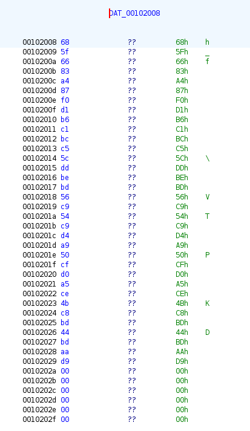

# Echauffement

## Speech
```
Un bon échauffement permet non seulement d'éviter des blessures, mais aussi de conditionner son corps et son esprit au combat qui va suivre. Ce crackme devrait constituer un exercice adéquat.
```
## Author
@Izipak (_hdrien)

## MD5
echauffement.bin = 13b79068ddc6ad8231d117ca5173ae61

## Solving

1. Some basics info gathering :
```bash
$ file echauffement.bin 
echauffement.bin: ELF 64-bit LSB pie executable, x86-64, version 1 (SYSV), dynamically linked, interpreter /lib64/ld-linux-x86-64.so.2, BuildID[sha1]=25249d3fcc57131140beb28b3c211d770f805818, for GNU/Linux 3.2.0, not stripped

$ strings echauffement.bin
/lib64/ld-linux-x86-64.so.2
mgUa
puts
stdin
fgets
strlen
Vous ne devinerez jamais le mot de passe secret ! Mais allez-y, essayez..
C'est bien ce que je pensais, vous ne connaissez pas le mot de passe..
Wow, impressionnant ! Vous avez r
ussi !
echauffement.c
secret_func_dont_look_here
```
2. ltrace and strace doesn't give much

### Ghidra
1. Let's begin with the *secret_func_dont_look_here* :
    ```C
    undefined4 secret_func_dont_look_here(long param_1)

    {
      size_t sVar1;
      undefined4 local_10;
      int i;
      
      sVar1 = strlen(secret_data);
      local_10 = 0;
      for (i = 0; i < (int)sVar1; i = i + 1) {
        if ((char)(*(char *)(param_1 + i) * '\x02' - (char)i) != secret_data[i]) {
          local_10 = 1;
        }
      }
      return local_10;
    }

    ```
Looks like the function which decipher our secret string
2. We can check in the main :
```C
undefined8 main(void)

{
  int iVar1;
  char local_48 [64];
  
  puts("Vous ne devinerez jamais le mot de passe secret ! Mais allez-y, essayez..");
  fgets(local_48,0x40,stdin);
  iVar1 = secret_func_dont_look_here(local_48);
  if (iVar1 == 0) {
                    /* print success phrases
                        */
    puts(&DAT_001020c8);
  }
  else {
    puts("C\'est bien ce que je pensais, vous ne connaissez pas le mot de passe..");
  }
  return 0;
}
```
We see the secret func is called and if she return 0 then it's win

### Decode
1. I take the *secret_data* :

2. Copy it in python table : [ 0x68, 0x5f, 0x66, 0x83, 0xa4, 0x87, 0xf0, 0xd1, 0xb6, 0xc1, 0xbc, 0xc5, 0x5c, 0xdd, 0xbe, 0xbd, 0x56, 0xc9, 0x54, 0xc9, 0xd4, 0xa9, 0x50, 0xcf, 0xd0, 0xa5, 0xce, 0x4b, 0xc8, 0xbd, 0x44, 0xbd, 0xaa, 0xd9, 0x00, 0x00, 0x00, 0x00, 0x00, 0x00 ]
3. Now we need to understand the calcul done : `((char)(*(char *)(param_1 + i) * '\x02' - (char)i) != secret_data[i])` we see the if take our input (`(char)(*(char *)(param_1 + i)`) and then multiply by `\x02` then substract `(char)i`
4. We need to do the inverse :
```Python
secret_data = [ 0x68, 0x5f, 0x66, 0x83, 0xa4, 0x87, 0xf0, 0xd1, 0xb6, 0xc1, 0xbc, 0xc5, 0x5c, 0xdd, 0xbe, 0xbd, 0x56, 0xc9, 0x54, 0xc9, 0xd4, 0xa9, 0x50, 0xcf, 0xd0, 0xa5, 0xce, 0x4b, 0xc8, 0xbd, 0x44, 0xbd, 0xaa, 0xd9, 0x00, 0x00, 0x00, 0x00, 0x00, 0x00 ]

original_data = []
for i in range(len(secret_data)):
  original_data.append((secret_data[i] + i) / 2)
original_data_char = [chr(int(value)) for value in original_data]
flag = ''.join(original_data_char)
print(flag)
```
5. Give us the flag : 404CTF{l_ech4uff3m3nt_3st_t3rm1ne}